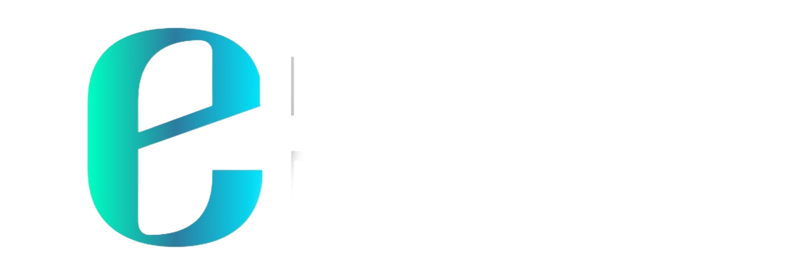

# e-Ration Hub - Smart Public Distribution System

  

## 🌐 Live Demo

  

🔗 **Quick Access:** [Open e-Ration Hub Website](https://e-rationhub.wuaze.com)

A web-based smart Public Distribution System developed using PHP and MySQL, aiming to modernize the food ration delivery system with digital ID verification, real-time stock management, and user-friendly interfaces.

🧩 Project Overview

This platform allows users to register using their Ration Card Number and Mobile Number to:
- View monthly ration allotments
- Check item availability across nearby ration shops
- Reserve ration items in advance to reduce queueing
- Enable authorities to track inventory and distribution digitally

It creates a bridge between users, ration shopkeepers, and government authorities to bring transparency, efficiency, and data clarity to Kerala’s public distribution system.

---

🔑 Features

- ✅ User Registration via Ration Card and Mobile Number
- ✅ Ration Availability Check at various ration shops
- ✅ Digital Booking of monthly ration
- ✅ Admin Panel for tracking and managing inventory
- ✅ Role-Based Access (Admin / User / Guest)
- ✅ Responsive UI using Bootstrap

---

👥 User Roles

 🛒 User
- Register & log in using ration details
- View current month's ration allotment
- See item stock at nearby ration shops
- Book ration to avoid long queues

 🧑‍💼 Admin
- Add and manage ration stock
- Approve users or ration shop registrations
- View reports on distribution and availability

 👀 Guest
- Can explore general site info and features without logging in

---

 ⚙️ Technologies Used

- Frontend: HTML, CSS, Bootstrap, JavaScript
- Backend: PHP (Core PHP)
- Database: MySQL
- Deployment: FileZilla + InfinityFree hosting

---

 📁 Folder Structure

Project/
├── Admin/
├── User/
├── Guest/
├── Assets/
│ ├── connection/
│ ├── css/
│ ├── images/
├── index.php
└── ...

---

 🚀 Future Enhancements

- 🚚 Home delivery for Below Poverty Line (BPL) families
- 🍼 Priority nutritional packages for children
- 👧 Ration customization for houses with girls above 10 years old
- 📊 Advanced analytics dashboard for state authorities

---

🧑‍🎓 About the Developer

Abin Eldhose
BCA Graduate | Flutter Developer  
Aspiring full-stack & mobile app developer with a strong interest in real-world problem solving, digital transformation, and public utility systems. Skilled in building cross-platform applications using Flutter and backend logic using PHP and MySQL.
